# EventFlow

EventFlow is a lightweight event check-in system that supports QR-code ticket scanning, manual guest lookup, duplicate check-in prevention, live attendance tracking, and an automatically updated event dashboard.

It uses a mobile-friendly frontend hosted with GitHub Pages, a Google Apps Script backend, Google Sheets for guest data, and Google Slides for the live dashboard.

---

## Features

- QR-code guest check-in
- Manual guest search
- Manual guest check-in
- Duplicate check-in prevention
- Invalid-ticket handling
- Party-size tracking
- QR vs. manual check-in logging
- Live attendance statistics
- Attendance progress visualizer
- Recent-arrivals dashboard
- Automatic dashboard refresh
- Mobile-friendly scanner interface
- Concurrent check-in protection

---

## Screenshots

### QR Scanner

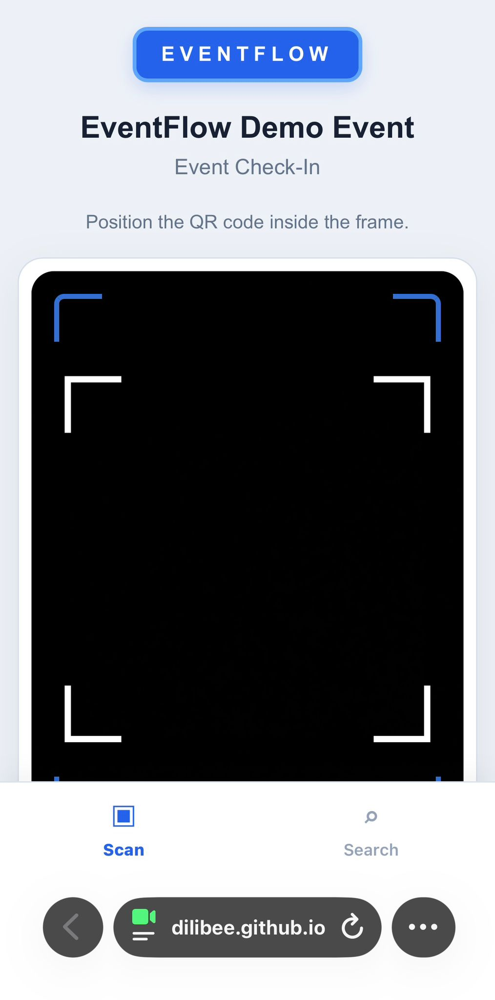

### Scanner in Use

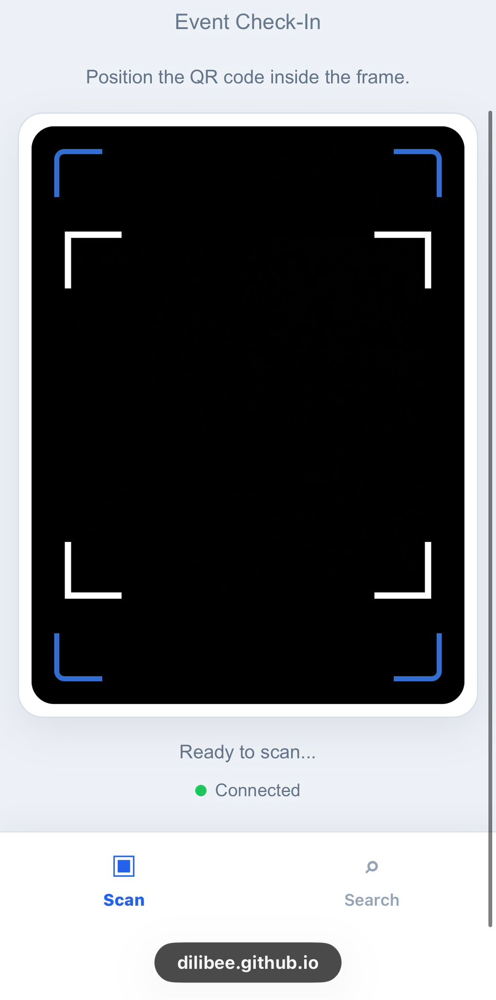

### Successful Check-In

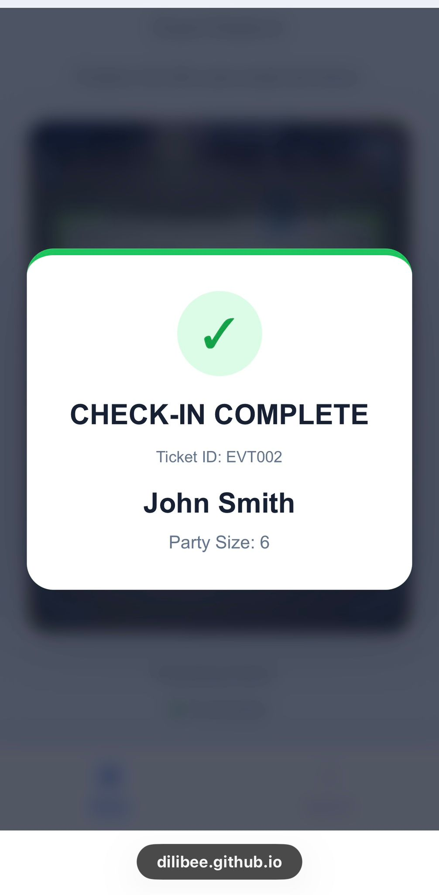

### Duplicate Check-In Protection

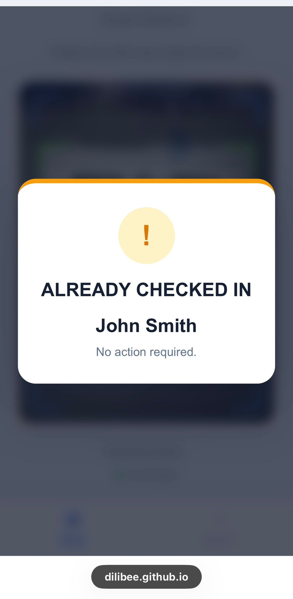

### Invalid Ticket Handling

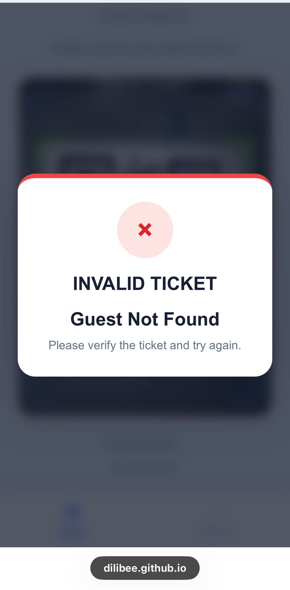

### Manual Guest Search

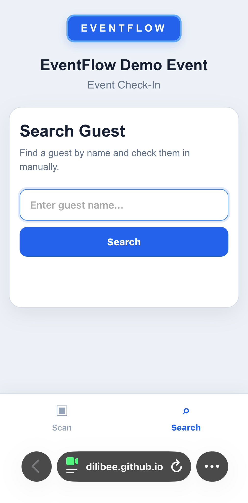

### Manual Check-In

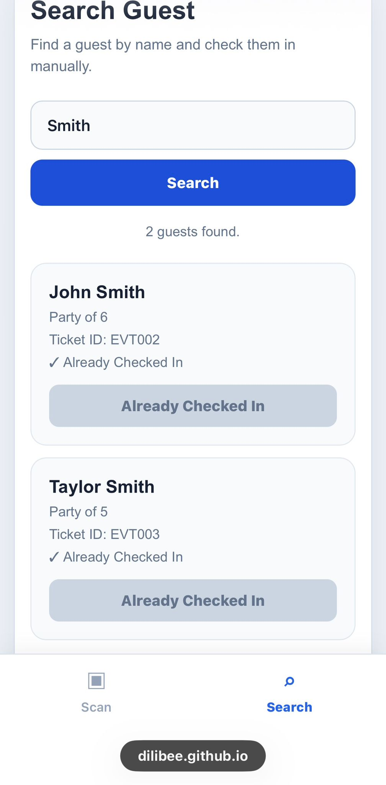

### Live Attendance Dashboard

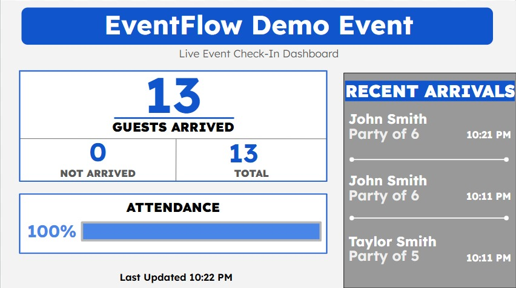

### Dashboard During Operation

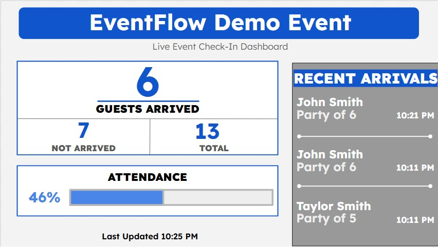

### Guest Database

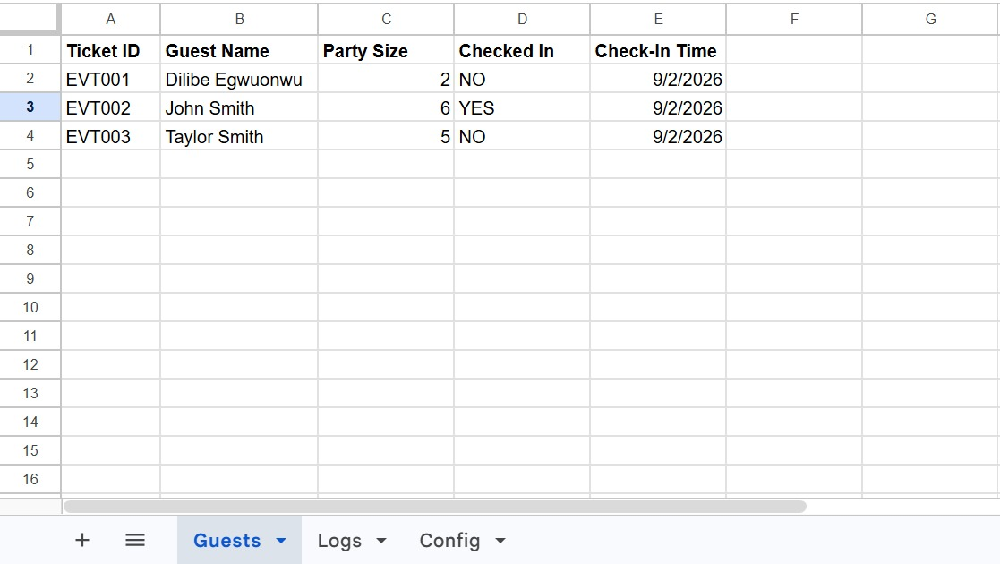

### Check-In Logs

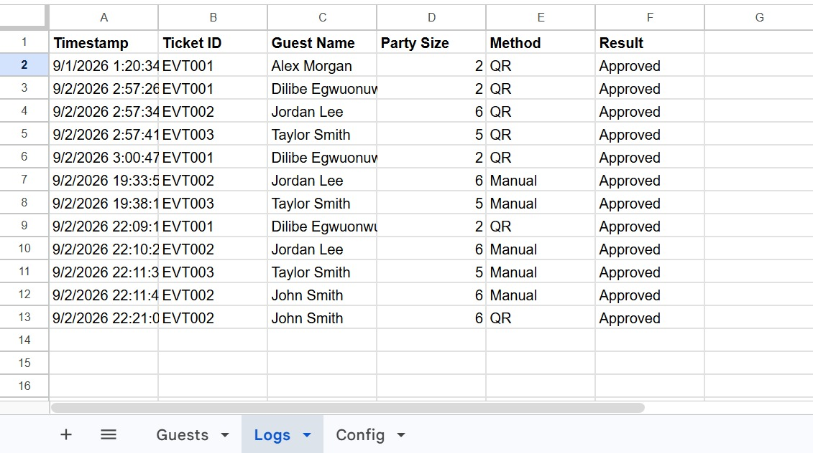

### Event Configuration

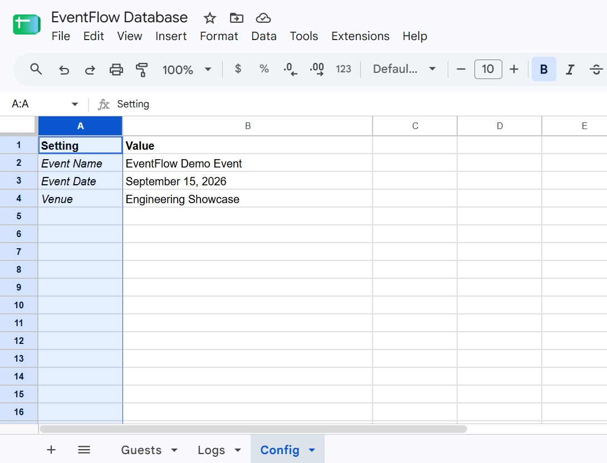

## How It Works

Event staff can check guests in using either a QR ticket or manual guest search.

Both methods communicate with the same Google Apps Script backend.

```text
QR Scanner ──────┐
                 │
                 ↓
          Google Apps Script
                 ↓
           checkInGuest()
                 ↓
        Guests + Logs Sheets
                 ↑
                 │
Manual Search ───┘
```

The guest database is then used to update a live Google Slides attendance dashboard.

---

## Architecture

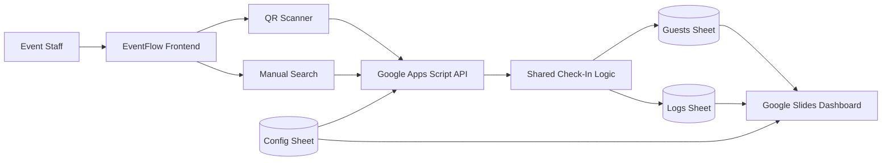

---

## Technology Stack

### Frontend
- HTML
- CSS
- JavaScript
- html5-qrcode
- GitHub Pages

### Backend
- Google Apps Script
- JavaScript

### Data Storage
- Google Sheets

### Dashboard
- Google Slides
- Google Apps Script

---

## Data Model

EventFlow uses three Google Sheets tabs.

### Guests

| Column | Purpose |
|---|---|
| Ticket ID | Unique ticket identifier |
| Guest Name | Primary guest name |
| Party Size | Number of guests represented by the ticket |
| Checked In | Current arrival status |
| Check-In Time | Time the guest was checked in |

Sample data:

`sample-data/guests.csv`

### Logs

| Column | Purpose |
|---|---|
| Timestamp | Time of check-in |
| Ticket ID | Ticket used |
| Guest Name | Guest associated with the ticket |
| Party Size | Number of guests |
| Method | QR or Manual |
| Result | Check-in result |

Sample data:

`sample-data/logs.csv`

### Config

Stores reusable event information such as:

- Event name
- Event date
- Venue

Sample data:

`sample-data/config.csv`

---

## Dashboard

The live dashboard displays:

- Guests checked in
- Guests not yet arrived
- Total guests
- Attendance percentage
- Dynamic attendance progress bar
- Checked-in parties
- Total parties
- Three most recent arrivals
- Party sizes
- Arrival times
- Last update time

Google Slides elements are identified using persistent alt-text identifiers, allowing their visible values to update repeatedly without losing their references.

---

## Technical Highlights

### Shared Check-In Logic

QR and manual check-ins both use the same `checkInGuest()` backend function.

This keeps validation and database updates centralized instead of duplicating the same logic in two places.

### Duplicate Check-In Prevention

EventFlow checks the guest's existing status before approving a check-in.

Already checked-in tickets are rejected.

### Concurrent Check-In Protection

Google Apps Script `LockService` is used during check-in operations to reduce the risk of two devices approving the same ticket simultaneously.

### Guest vs. Party Tracking

One ticket may represent multiple people.

EventFlow therefore tracks both:

- individual guests
- parties/tickets

Attendance totals are calculated using party size rather than simply counting database rows.

### Persistent Dashboard Elements

The original dashboard used visible placeholders that disappeared after being replaced.

The rebuilt version identifies Google Slides elements using alt text, allowing the displayed values to change repeatedly while the identifier remains intact.

---

## Setup

### 1. Create the Google Sheet

Create three tabs:

```text
Guests
Logs
Config
```

The sample CSV files in `sample-data/` show the expected structure.

### 2. Add the Apps Script Code

Open the Google Sheet and select:

```text
Extensions → Apps Script
```

Add the files from:

```text
apps-script/
```

### 3. Authorize Permissions

The Apps Script project owner must authorize access to Google Sheets and Google Slides when the project is run for the first time.

Users of the QR scanner must also allow browser camera access.

### 4. Configure the Dashboard

Create a Google Slides dashboard and set the required alt-text identifiers on its dynamic elements.

Replace:

```javascript
const DASHBOARD_SLIDE_ID = "YOUR_GOOGLE_SLIDES_ID";
```

with the ID of the presentation.

### 5. Deploy the API

Deploy the Apps Script project as a Web App.

Copy the generated `/exec` URL.

### 6. Configure the Frontend

In:

```text
frontend/scanner.js
```

replace:

```javascript
const API_URL = "YOUR_APPS_SCRIPT_WEB_APP_URL";
```

with the deployed Apps Script URL.

---

## Project Structure

```text
EventFlow/
│
├── frontend/
│   ├── index.html
│   ├── scanner.js
│   └── style.css
│
├── apps-script/
│   ├── Code.gs
│   └── Dashboard.gs
│
├── sample-data/
│   ├── guests.csv
│   ├── logs.csv
│   └── config.csv
│
├── docs/
│   ├── screenshots/
│   └── architecture.md
│
├── README.md
├── .gitignore
└── LICENSE
```

---

## Testing

EventFlow was tested for:

- Valid QR check-in
- Invalid QR tickets
- Duplicate QR scans
- Exact and partial guest search
- Case-insensitive search
- Multiple search results
- Manual check-in
- Manual duplicate prevention
- QR after manual check-in
- Manual check-in after QR check-in
- Scan/Search navigation
- Mobile camera permissions
- Party-size calculations
- Dashboard statistics
- Attendance progress visualization
- Recent-arrival ordering
- Automatic dashboard updates

---

## Future Improvements

Possible future extensions include:

- Multiple-event support
- Staff authentication
- Role-based access
- Guest-list CSV importing
- Ticket generation interface
- Event analytics
- Dedicated hosted database
- Offline check-in support

---

## License

This project is licensed under the MIT License.
